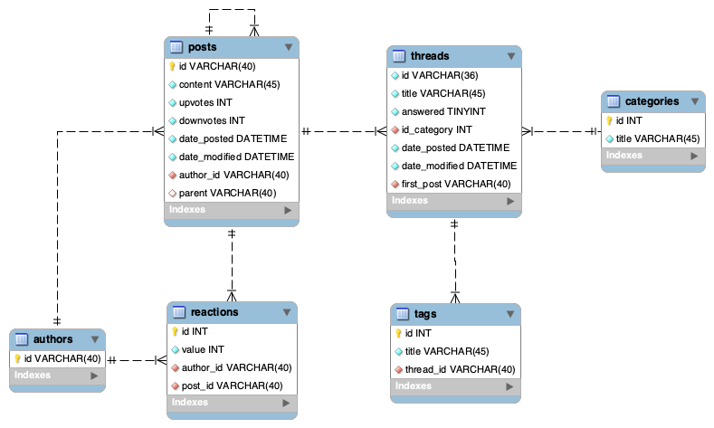

# Micro Service Student Help
## (Put a tree emoji here) Tree Structure
```
├───.idea
└───ms_studenthelp
    ├───.gradle
    │   ├───7.2
    │   │   ├───dependencies-accessors
    │   │   ├───executionHistory
    │   │   ├───fileChanges
    │   │   ├───fileHashes
    │   │   └───vcsMetadata-1
    │   ├───7.5.1
    │   │   ├───checksums
    │   │   ├───dependencies-accessors
    │   │   ├───executionHistory
    │   │   ├───fileChanges
    │   │   ├───fileHashes
    │   │   └───vcsMetadata
    │   ├───buildOutputCleanup
    │   ├───checksums
    │   └───vcs-1
    ├───.settings
    ├───bin
    │   ├───main
    │   │   └───be
    │   │       └───ecam
    │   │           └───ms_studenthelp
    │   │               ├───Database
    │   │               │   └───mysql
    │   │               │       └───MySqlSerializer
    │   │               ├───Interfaces
    │   │               ├───Object
    │   │               └───utils
    │   └───test
    │       └───be
    │           └───ecam
    │               └───ms_studenthelp
    ├───build
    │   ├───classes
    │   │   └───java
    │   │       └───main
    │   │           └───be
    │   │               └───ecam
    │   │                   └───ms_studenthelp
    │   │                       ├───Database
    │   │                       │   └───mysql
    │   │                       │       └───MySqlSerializer
    │   │                       ├───Interfaces
    │   │                       ├───Object
    │   │                       └───utils
    │   ├───generated
    │   │   └───sources
    │   │       ├───annotationProcessor
    │   │       │   └───java
    │   │       │       └───main
    │   │       └───headers
    │   │           └───java
    │   │               └───main
    │   ├───resources
    │   │   └───main
    │   └───tmp
    │       └───compileJava
    ├───gradle
    │   └───wrapper
    └───src
        ├───main
        │   ├───java
        │   │   └───be
        │   │       └───ecam
        │   │           └───ms_studenthelp
        │   │               ├───Database
        │   │               │   └───mysql
        │   │               │       └───MySqlSerializer
        │   │               ├───Interfaces
        │   │               ├───Object
        │   │               └───utils
        │   └───resources
        └───test
            └───java
                └───be
                    └───ecam
                        └───ms_studenthelp
```

## Project Context
As part of the Architecture and Software Quality course, we have to design a fullstack school management application. 

## Assigned Task
In such a way, our team will focus on the student support platform.

## Installation

### Windows
- make sur to have wamp installed (or a mysql server)
- install the java jdk
- you may need to install mysql connectorJ and add it to your PATH ( System(Control Panel) => Advanced system settings => Environment Variables => New System Variable => [value of the PATH])

### Linux
- install mysql
- - you may want to install phpmyadmin
- install java jdk
- install mysql java connector

### common
- Copy the repo
- Create a database:
- - Name : `ms_studenthelp`
- - Import : `ms_studenthelp.sql`

- Create a mysql user named `dummy` with password `1234` , grant him data acces on `ms_studenthelp`

## API

Our OpenAPI schema is in [`schema.yaml`](schema.yaml).
It also has a generated doc available at https://beta.bachelay.eu/ms-studentHelp

## Database

Uses a MySQL/MariaDB database.

The schema is available in [`ms_studenthelp.sql`](ms_studenthelp.sql)

The database credentials are curently hardcoded in [`ms_studenthelp/src/main/java/be/ecam/ms_studenthelp/Database/mysql/MySqlDatabase.java`](ms_studenthelp/src/main/java/be/ecam/ms_studenthelp/Database/mysql/MySqlDatabase.java)

- server on `localhost`
- database named `ms_studenthelp`
- username `dummy` with password `1234`

## Diagram
### Database



### Class

